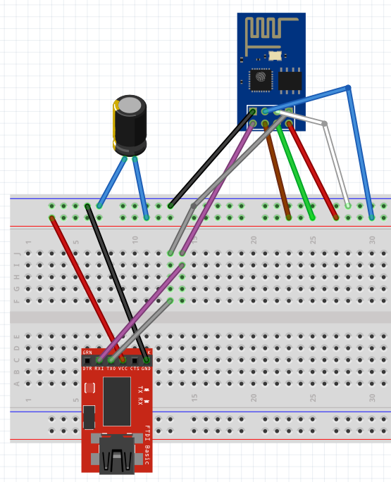
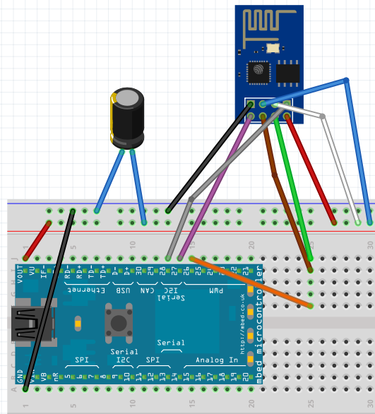

EE 250L Spring 2018: Example to run MQTT over WiFi with the LPC1768 and ESP8266 
devices.

## Summary

The main purpose for this repository is to show an educational example of a
multi-threaded, (mostly) event-based MQTT application built on top of mbed OS 
using the ESP8266-01 wifi interface. This code is configured for the mbed 
LPC1768 board, but should be compatible for other mbed OS capatible boards. Use
this repository to help you get started with MQTT. You are in charge of figuring
out how to put this together on your m3pi after you get it to work.

## Preface

This repository is intended for educational purposes. The code here is heavily
commented, and we absolutely welcome any recommendations to improve the code or 
documentation. Please communicate to us via an issue. Pull requests are welcome!

## Overview (to run this example out of the box)

Please go to this link for more information:

https://docs.google.com/presentation/d/1ARA3xXL0szzalFOxm3kWwiWfmI4XSZnZ-C4sqZksHAo/edit#slide=id.g36eca9d95f_0_316

Steps Summary:

1) Update the firmware of the LPC1768 (you need to do this) and ESP8266-01 (this
is done)
2) Follow the Fritzing diagram to connect the LPC1768 to the ESP8266-01
3) Edit the MQTT broker hostname and port macros in main.cpp accordingly
4) Configure your mbed_app.json with your wifi SSID and PW
7) Boot everything up. To test if everything is working, publish to the topic
`m3pi-mqtt-ee250` via our broker on eclipse at port 11000. Use the linux tool
`mosquitto_pub` to do this quickly.

## Motivation

1) While mbed OS is well documented with many examples (including examples of
using MQTTClient), there is a lack of more complex example applications to 
illustrate the use of the mbed OS API. In addition, there is not a single 
place that documents how to run MQTT with an ESP8266 device in mbed OS. This
repository is provided to help fill these gaps.

2) Covering ISRs, polling loops, etc. is the first step of learning embedded 
programming. The next step is to equip students with the ability to program 
richer applications. Embedded operating systems and programming design patterns 
can empower students to create these applications with cleaner code. This 
application example uses the simple dispatcher programming pattern with the use 
of mbed OS libraries typically available on other embedded OSes. Patterns are
hard for students to wrap their head around, and teaching from a book has not 
shown to be very effective. We have found showing deeper examples illustrating 
how a pattern is useful and having students develop using the pattern helps 
students understand their uses and overall create richer applications (with
more organized code!). One way to use this repository is start by reading 
through this example carefully and running the code. Then, use the structure
of this example and cater it to your target application.

## Powering the ESP8266-01

The ESP8266-01 (or ESP-01) chip takes a 3.3V power supply. Powering it with 5V
may burn the chip, so please be careful with this, especially because the 
LPC1768 has a 5V output right next to the 3.3V output. The ESP-01 needs a clean 
3.3V power supply so filtering a 3.3V output from the mbed board with a large 
capacitor (we have 100uF+ capacitors just in case) will help prevent the ESP-01 
from random power cycles. Also, even though the GPIO2 pin is not used, we 
connect it to VCC (high) to try to further prevent power cycles. We are not 
quite sure if this matters but we have found many reports of needing to do this 
on forums.

## Updating the mbed LPC1768 and ESP8266-01 Firmware

LPC1768:

Updating the LPC1768 is very simple, and an updated firmware is needed for 
mbed OS 5+ support. Follow the instructions at 
[this page.](https://os.mbed.com/handbook/Firmware-LPC1768-LPC11U24)
The firmware revision we use is 141212.

ESP8266-01:

We have already updated your ESP8266-01. However, if you are interested, here 
are the instructions on how to do it. Updating the ESP8266-01 (or simply ESP-01) 
is a more involved process. First, we have found That
using an mbed board as a serial passthrough does NOT work very well. It works if
you use specific esptool versions and slow down the flash block sizes. Please 
purchase an FTDI board with a 3.3V output to save you the headache. We 
specifically used
[this one from Amazon](https://www.amazon.com/KEDSUM-CP2102-Module-Download-Converter/dp/B009T2ZR6W). 
Below is a Fritzing diagram of our setup for flashing the ESP8266.



Clone the latest version of the 
[esptool](https://github.com/espressif/esptool) to flash your ESP-01. Also, 
clone the 
[ESP8266_NONOS_SDK](https://github.com/espressif/ESP8266_NONOS_SDK) repository 
to get the AT firmware binaries we used to flash our ESP-01. The ESP8266 comes 
in very many flavors, and there are many revisions (and manufacturers?) of the 
ESP-01. We purchased our modules from multiple different vendors on Amazon, and 
these settings seem to work for all the ESP-01's we've received. Hopefully, the 
settings and version we successfully used will also work for you. The AT 
firmware binaries we used were from the master branch at commit 
[509eae8515793ec62f6501e2783c865f9a8f87e3](https://github.com/espressif/ESP8266_NONOS_SDK/tree/509eae8515793ec62f6501e2783c865f9a8f87e3)
of the ESP8266_NONOS_SDK repository. Since we have the 1MB flash variant, we 
used the binary files listed below. To prepare for flashing, consolidate all the 
following binary files into one folder (TODO, list paths to these files in the
ESP8266_NONOS_SDK repository):

* bin/boot_v1.6.bin
* bin/at/512+512/user1.1024.new.2.bin
* bin/esp_init_data_default.bin
* bin/blank.bin

Before you can flash, you need to boot into the ESP8266's bootloader. To do this,
make sure your setup is wired up as shown in the Fritzing diagram above. The
key connections is the GPIO0 pin needs to be connected to GND upon reset to
boot into the bootloader. Reset the ESP8266 by moving the "RST" pin to GND and
then back to 3.3V VCC. Then, flash using the following commands. Make sure to 
change the port value to the path of your USB to TTL serial adapter:

    cd esptool/
    ./esptool.py --port /dev/ttyUSB0 --baud 115200 write_flash -fm dout -fs 1MB \
    -ff 26m 0x00000 ~/ESP8266_NONOS_SDK/bin/boot_v1.6.bin \
    0x01000 ~/ESP8266_NONOS_SDK/bin/at/512+512/user1.1024.new.2.bin \
    0xfc000 ~/ESP8266_NONOS_SDK/bin/esp_init_data_default.bin \
    0x7e000 ~/ESP8266_NONOS_SDK/bin/blank.bin

To test if the flash worked, you can use a serial terminal program like CuteCom
with CR,LF line endings and send AT commands. You can refer to Espressif's
[documentation.](https://www.espressif.com/sites/default/files/documentation/4a-esp8266_at_instruction_set_en.pdf)
Here is a series of commands that will set the ESP8266 to station mode and scan
WiFi access points:

    AT+CWMODE_CUR=1
    AT+CWLAP

## Compiling and Running this Example in Linux

It is possible to import this example into the mbed OS online compiler to
build. However, we only provide instructions for compiling using 
[mbed-cli](https://github.com/ARMmbed/mbed-cli). 
First, install the pre-reqs (mbed-cli only currently supports python2 so please
install pip2 using the get-pip.py script that can be found online 
`sudo python2 get-pip.py`):

1. `sudo pip2 install mbed-cli`
2. `sudo apt-get install mercurial gcc-arm-none-eabi`
3. Install python packages: `pip2 install -r requirements.txt`
4. Install python, libusb and libncursus (i386 to be compatible with arm-none-eabi-gdb)
    
        sudo apt-get install python libusb-1.0-0-dev libncurses5:i386

5. It might be necessary to update your USB settings to get non-root access to DAP:

        sudo sh -c 'echo SUBSYSTEM==\"usb\", ATTR{idVendor}==\"0d28\", ATTR{idProduct}==\"0204\", MODE:=\"666\" > /etc/udev/rules.d/mbed.rules' 
        sudo /etc/init.d/udev restart 

Before compiling, clone this repository or fork the repoisitory and clone your 
fork. You will be building on top of this example, so do whatever you
need to create your own repository using these files. The next step is to 
initialize the directory into an mbed project and designate the compiler and 
target. 

```
cd m3pi-mqtt-ee250/
mbed deploy
mbed new .
mbed toolchain GCC_ARM
mbed target LPC1768
```

We have created a script for you that does a clean compile, flashes, and terms
using `pyterm` that's also in RIOT-OS which we have also included in this 
repository for your convenience. To run these scripts WITHOUT sudo, you will 
need to add your user to the `dialout` group to get access to USB devices. We 
should not see any use of `sudo` to flash your LPC1768s!

    sudo adduser $USER dialout

Restart your linux machine. If you are using a VM, pass the mbed device through
to the guest OS via your Virtualization tool (e.g. Virtualbox). Next, wire up
the LPC1768 to the ESP8266 like the Fritzing diagram below:



Once you are finished, return to the code and do the following:

1) Edit the MQTT broker hostname and port macros in main.cpp accordingly
2) Configure the mbed_app.json file with your wifi SSID and PW. Leave the 
password blank (i.e. "") if it's an open network. 

If the ESP8266 is not successfully connecting to your WiFi access point, see
the WiFi AP troubleshooting section below. Carefully read the printouts of the
connection process to determine if it's really a problem with your AP first!

Then, run the script provided to try to compile, flash, and term. Read through 
the python script to learn how we do this in case you need to use only a subset
of the commands during your development process.

    python2 flash_and_term.py

On the first flash, you actually have to manually drop a binary into the LPC1768
before the flashing script fully works. On the first execution of the python
script, find the compiled binary file 
`m3pi-mqtt-ee250/BUILD/LPC1768/GCC_ARM/m3pi-mqtt-ee250.bin` and drag/drop it
directly into the flash drive that pops up when you plug in the LPC1768. Now 
that a binary file is in there, you should be able to use the flash_and_term.py 
script to flash your LPC1768  instead of manually dropping in a binary file.
Upon every new flash, you will have to press reset button the LPC1768 to start
the newly flashed program. Read the printouts to see if the program is able to 
connect to your wifi access point and our MQTT broker. If it's working, you 
can start testing if everything is working via MQTT. In a linux terminal,
use the `mosquitto_pub` program to test your connection with the commands below.

First, open a terminal and subscribe to the topic "m3pi-mqtt-ee250/led-thread"

    mosquitto_sub -h eclipse.usc.edu -p 11000 -t "m3pi-mqtt-ee250/led-thread"

Then, open another terminal and type this command to trigger the first case in 
the PrintThread.

    echo -ne "\x00\x00" | mosquitto_pub -h eclipse.usc.edu -p 11000 -t "m3pi-mqtt-ee250" -s

Trigger the second case in PrintThread:

    echo -ne "\x00\x01" | mosquitto_pub -h eclipse.usc.edu -p 11000 -t "m3pi-mqtt-ee250" -s

Trigger the LEDThread to publish to "m3pi-mqtt-ee250/led-thread" (monitor your
susbcriber terminal):

    echo -ne "\x01\x00" | mosquitto_pub -h eclipse.usc.edu -p 11000 -t "m3pi-mqtt-ee250" -s

Trigger the LEDThread to turn on LED2 for one second:

    echo -ne "\x01\x01" | mosquitto_pub -h eclipse.usc.edu -p 11000 -t "m3pi-mqtt-ee250" -s

Trigger the LEDThread to blink LED2:

    echo -ne "\x01\x02" | mosquitto_pub -h eclipse.usc.edu -p 11000 -t "m3pi-mqtt-ee250" -s

If you write a python script to message the mbed in this example, you will have
to publish binary data (not a string or binary string). We use raw bytes because
it's easier to code on the C++ side. The LPC1768 is an embedded device running 
C++, so there's no magic! 

## Understanding the Code

**You will need to spend time reading the code, otherwise you won't be able to
modify it to suit your application needs. As usual, start at the main() function
in main.cpp!**

## Moving the m3pi Robot

We have provided a movement() function for you to use. If you want to use it
in a different .cpp file (e.g. the different thread files), then you can 
extern the movement() function in that .cpp file to use it. Read the 
movement() function comments followed by the example we provided and commented 
out in the main() function. Uncomment the sequence of movement commands, flash
the mbed LPC1768, and see how your robot moves!

## WiFi AP Troubleshooting

The ESP8266 has very barebones code that may not be handled well by different
wierless routers. We've found a lot of problems arise when using password 
protected access points. Test to see if the ESP8266 can connect to an open 
network first. If this works, then you may have to change your router's 
authentication settings. Try all the different WPA authentication types. That 
is, try WPA with AES, WPA with TKIP, WPA with AES+TKIP, WPA2 with AES, and so 
on. WiFi Multimedia (WMM) is also known to cause problems with the ESP8266. 
Turn that setting off in your router.
